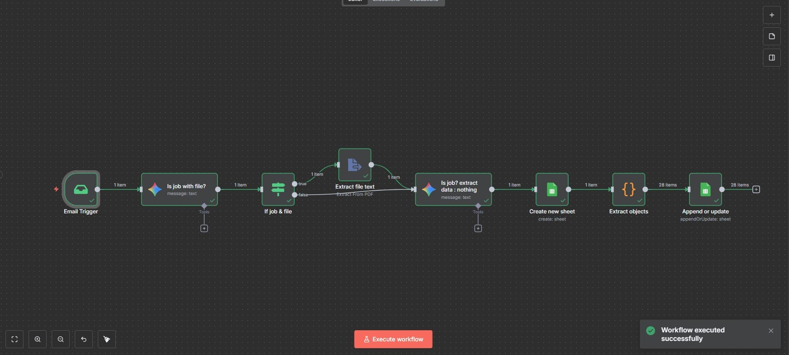

### Personal Data Extractor
An automated personal data extraction system featuring:

- Automated extraction of personal information from documents
- AI-powered data parsing and recognition
- Structured data output
- Automated processing workflow
- Data validation and verification

## Implementation Details

### Personal Data Extractor Implementation
The personal data extraction workflow processes documents and extracts relevant information:

1. **Document Processing**:
   - Handles various document formats
   - Extracts text content
   - Identifies relevant sections

2. **AI Data Extraction**:
   - Recognizes personal information patterns
   - Extracts key data points
   - Validates extracted information

3. **Data Management**:
   - Structured data output
   - Organized information storage
   - Easy data retrieval

#### Personal Data Extractor Workflow

## Getting Started

To use this workflow:

1. Create a workflow in n8n portal
2. Import the ExtractPersonalData.json workflow file
3. Configure your credentials for:
   - Document processing services
   - AI services for data extraction
   - Storage services (if applicable)
4. Customize the workflow parameters as needed

Note: Ensure compliance with data protection regulations when processing personal information.